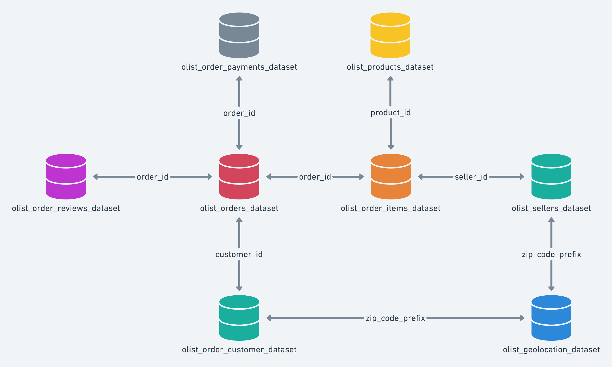

# My Project is myprojectecommerce
This dataset contains information about the customer and its location. You can use this dataset to identify unique customers in the order dataset and find the delivery location of orders. 
I can say that I have opened new sails in the field of data science. It was a project that I gained some experience in many different fields and enjoyed preparing.
It is the project in which Brazil's E-Commerce Public Datasets are processed by Olist. While preparing this project, I benefited from many educational channels and documents. I will give them one by one in the links section. Let me briefly talk about what these E-commerce datasets are.

# Explanation
"This is a Brazilian ecommerce public dataset of orders made at Olist Store. The dataset has information of 100k orders from 2016 to 2018 made at multiple marketplaces in Brazil. Its features allows viewing an order from multiple dimensions: from order status, price, payment and freight performance to customer location, product attributes and finally reviews written by customers. We also released a geolocation dataset that relates Brazilian zip codes to lat/lng coordinates.

This is real commercial data, it has been anonymised, and references to the companies and partners in the review text have been replaced with the names of Game of Thrones great houses."
* https://www.kaggle.com/olistbr/brazilian-ecommerce

# Data Schema
The data is divided in multiple datasets for better understanding and organization. Please refer to the following data schema when working with it:

# TODO List

* Initialize Apache Airflow and Spark
* Construct diagram on Airflow
* Get data via Kaggle
* AWS Platform and S3

# Main Objectives

* Construct a mock production data lake that is replete with dataset schema
* Analyze and clean the datasets
* Write a Spark and Spark SQL job to join together tables answering the question, 
"which sellers missed their orders" deadline to be delivered to a carrier?
* Build the ETL pipeline using Airflow that accomplishes the following:
  * Downloads data from an AWS S3 bucket
  * Runs a python script job that cleans the downloaded data and writes it to another folder to be used by the next job.
  * Runs a Spark/Spark SQL job on the clean data producing a dataset of delivery deadline missing orders.
  * Upload the output dataset to the same S3 bucket in a folder for use for higher-level analytics.

# Used Techologies:
 FaQ
* AWS S3 üzerinden data çekimi yapmak için boto3 kütüphanesinden yararlandık. Kütüphane S3 üzerinde daha önce eklediğimi dataları çekmemizde ve düzenlemizde yararlı olacaktır. 
* Daha önceden S3 üzerinde verilerimizin yüklemesini sağlamadım, bu sebeple AWS S3 üzerinden çalışmalarım bitti.
* Brazillian ECommerce Projesine kadar her hangi bir platformda Airflow, Spark ve AWS S3 yapılarını kullanmadığım için internet üzerinde araştırmalar yaptım. 
* Bilgi edindiğim yerlerin linkini aşağıya bırakacağım.
* Verilen şemayı incelediğim de cevap istenilen soruya -> "Which seller missed their orders' deadline to be delivered to a carrier ?" göre merge işlemlerini yapmam gerekiyormuş.

# Links
* How to Read Data from S3 using Python ( BOTO3 ) API
  * https://www.youtube.com/watch?v=Expy4DjViy4
* AWS ETL - Configure AWS Data Pipeline from MySql and S3
  * https://www.youtube.com/watch?v=u8Mub3ytUMg
* Apache Spark'a Giriş
  * https://www.youtube.com/watch?v=rkyUubl4Wo0

